# Plasticity Yield Criteria Visualizer

Interactive Python visualizations of the classical yield criteria in
plasticity — **Tresca**, **von Mises**, and **Drucker-Prager** — in 3D
principal stress space, in the deviatoric π-plane, and in plane stress.
Plot any criterion alone or any combination together. One file, a
graphical interface, a question-and-answer mode, and command-line flags;
every constant has a sensible default, so you can just press Enter and
look at the shapes.

<p align="center">
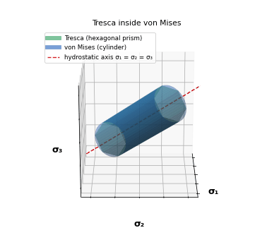
</p>

## Run it

Download or clone the repository, install the two dependencies once, and
run the one file:

```bash
pip install numpy matplotlib
python yield_criteria.py
```

That opens the **graphical interface**: tick the criteria you want, pick a
view, press **Plot**.

> [!TIP]
> 3D plots open in a window you can **drag with the mouse to rotate**, and
> scroll to zoom. Every input box already holds a default value, so the
> first plot is one click away.

Other ways to run the same thing:

```bash
python yield_criteria.py --cli                                 # asks you the questions one by one
python yield_criteria.py --criterion mises --view 3d            # straight to a plot
python yield_criteria.py --criterion tresca mises --view plane  # two criteria together
python yield_criteria.py --criterion all --view 3d              # all three together
python yield_criteria.py --criterion drucker --eta 0.5          # Drucker-Prager cone, eta = 0.5
python yield_criteria.py --criterion both --view deviatoric --sy 250 --save pi_plane.png
```

| Option | Meaning | Default |
|---|---|---|
| `--criterion` | one or more of `tresca` `mises` `drucker`; shortcuts `both` (Tresca + von Mises) and `all` | GUI opens |
| `--view` | `3d`, `deviatoric` (π-plane), or `plane` (σ₃ = 0) | `3d` |
| `--sy` | yield stress for Tresca / von Mises (any units) | 1 |
| `--cbar`, `--eta` | Drucker-Prager constant c̄ and friction parameter η | 1, 1 |
| `--save FILE` | write a PNG/PDF instead of opening a window | show |

> [!NOTE]
> Stresses are in whatever units you enter; with the default σ_y = 1 the
> plots are normalized, which is usually what you want for seeing the
> shapes. Enter a real yield stress (say 250 for MPa) to get real axes.

## What you get

### Principal stress space (3D, rotatable)

Each surface is drawn around the hydrostatic axis σ₁ = σ₂ = σ₃ (dashed
red). Tresca is a hexagonal prism, von Mises a circular cylinder that
circumscribes it, and Drucker-Prager a cone whose opening angle is set by η.

| Tresca | von Mises | Tresca + von Mises |
|---|---|---|
| 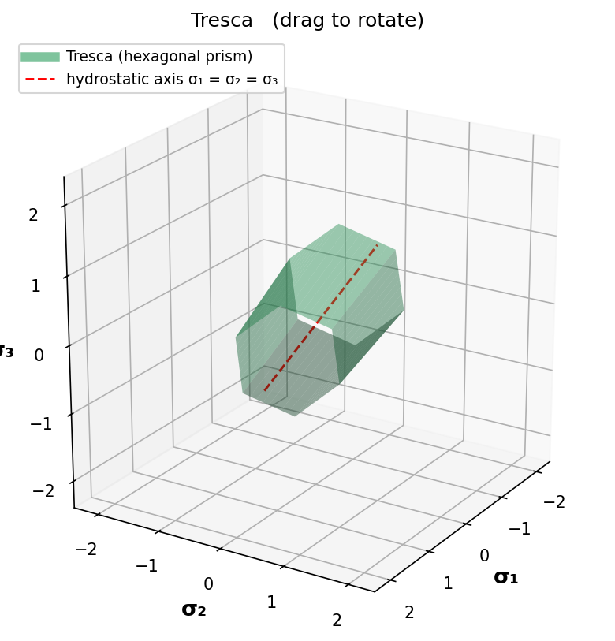 | 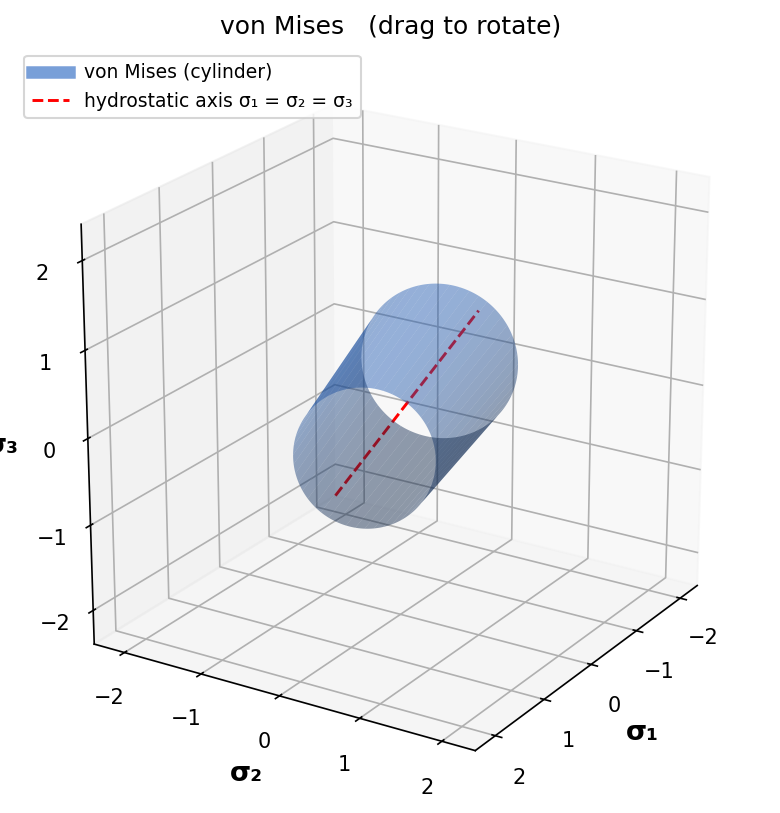 | 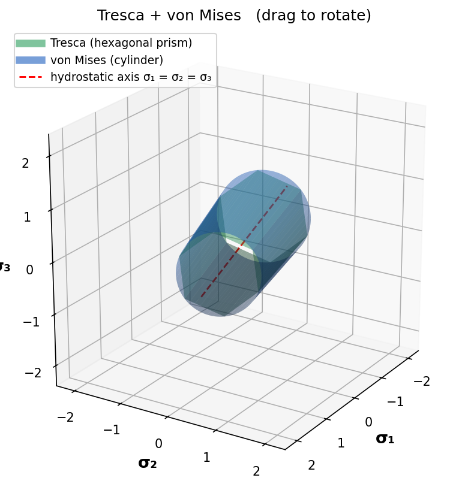 |

| Drucker-Prager, η = 0.5 | Drucker-Prager, η = 1 | All three |
|---|---|---|
| 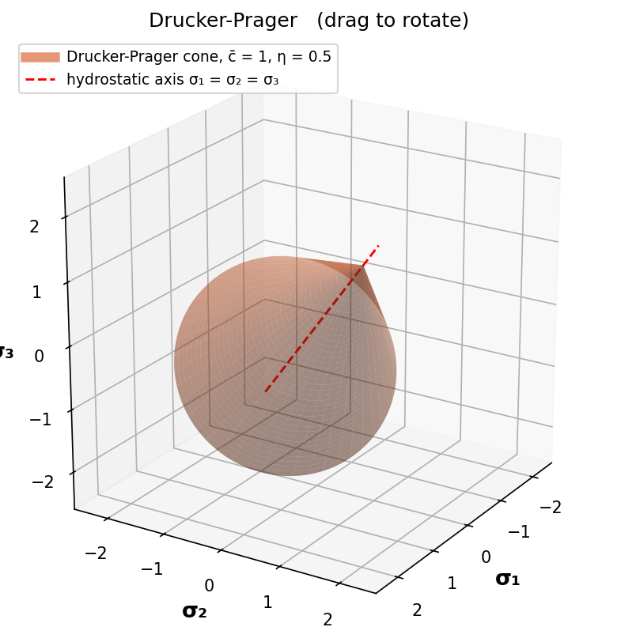 | 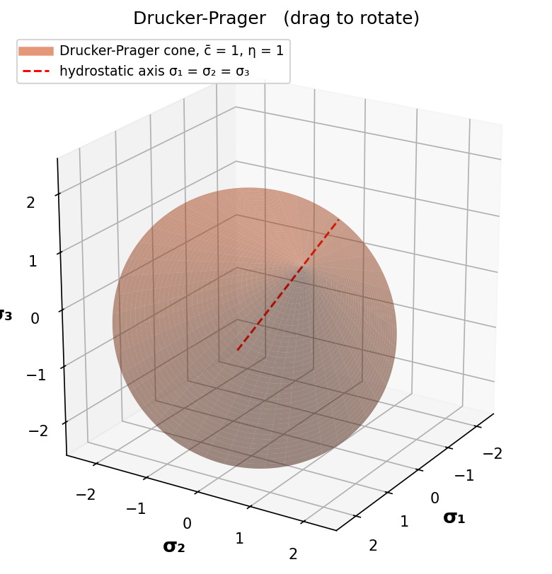 | 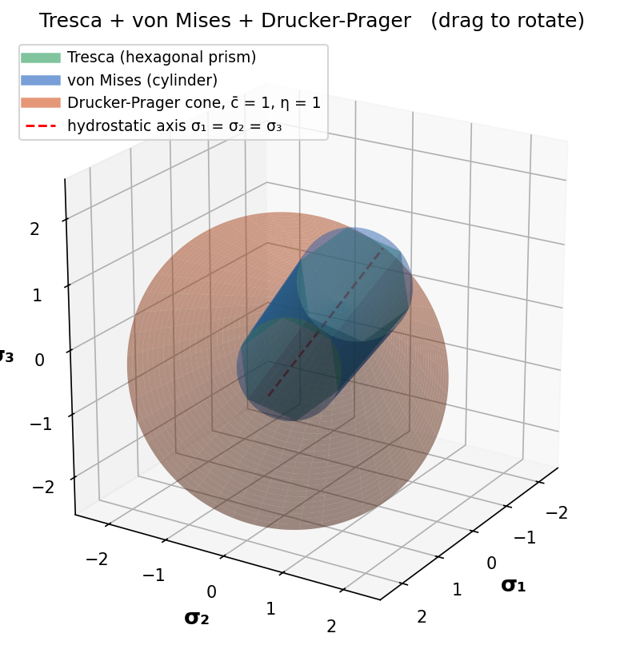 |

> [!IMPORTANT]
> The von Mises cylinder always **circumscribes** the Tresca prism; they
> touch only along the six uniaxial-stress edges. That is why Tresca is
> the conservative choice: it predicts yield at or before von Mises for
> every stress state.

### Deviatoric π-plane

The plane perpendicular to the hydrostatic axis, with the projected σ₁,
σ₂, σ₃ directions 120° apart. Tresca is a regular hexagon inscribed in the
von Mises circle of radius ρ = √(2/3)·σ_y; they touch at the six uniaxial
directions. For Drucker-Prager the section is a circle whose radius grows
with hydrostatic compression.

| Tresca + von Mises | Drucker-Prager at several ξ | All three (ξ = 0 section) |
|---|---|---|
| 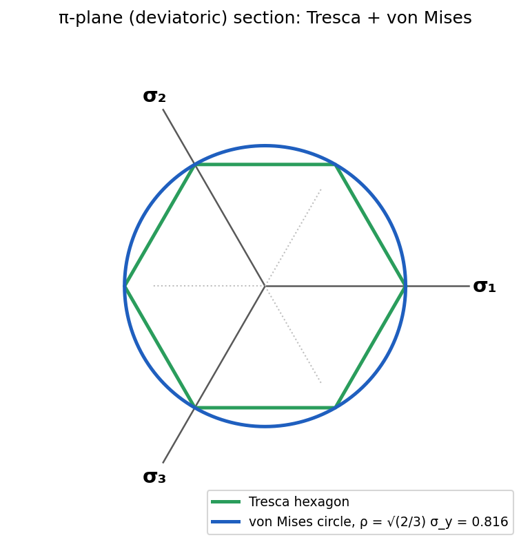 | 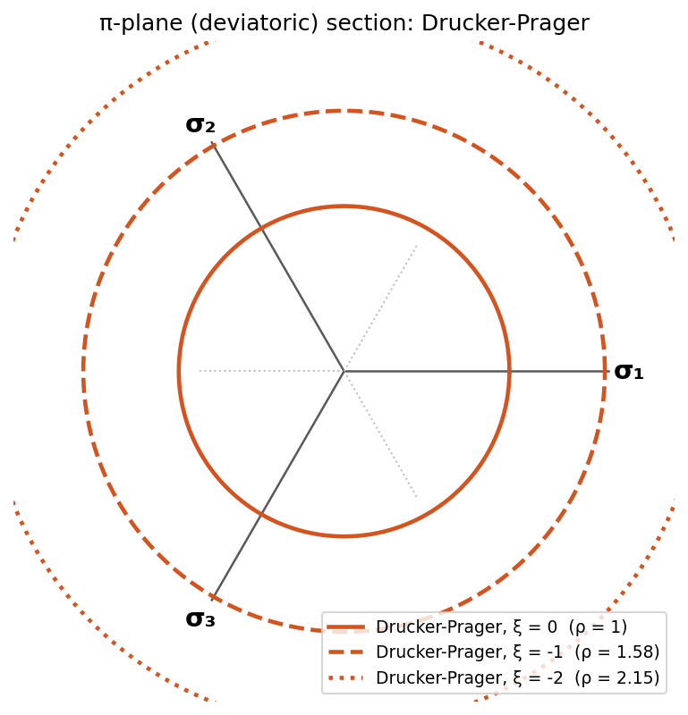 | 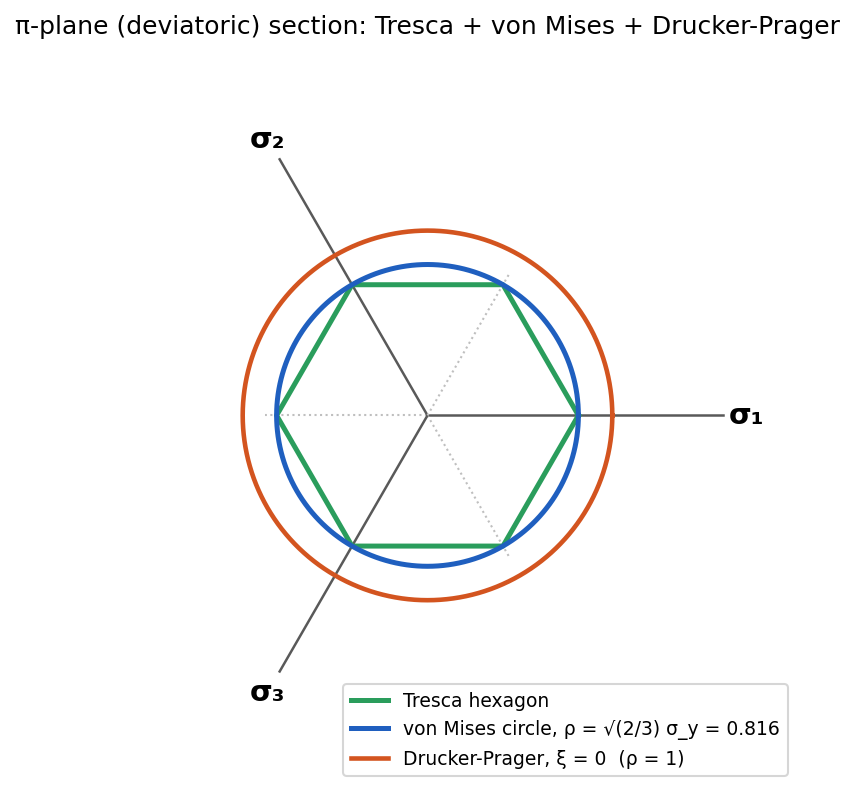 |

> [!NOTE]
> For Tresca and von Mises the π-plane section is the **same at every
> hydrostatic pressure** — that is the geometric meaning of "pressure
> independent". Drucker-Prager's section changes with pressure, so when it
> is plotted alone the tool draws it at three levels ξ, and when it is
> combined with the others it shows the ξ = 0 section.

### Plane stress (σ₃ = 0)

The classic textbook picture: the Tresca hexagon inside the von Mises
ellipse in the σ₁–σ₂ plane — and, with Drucker-Prager added, the
pressure-sensitive loop that is tight in tension and open in compression.

| Tresca + von Mises | All three |
|---|---|
| 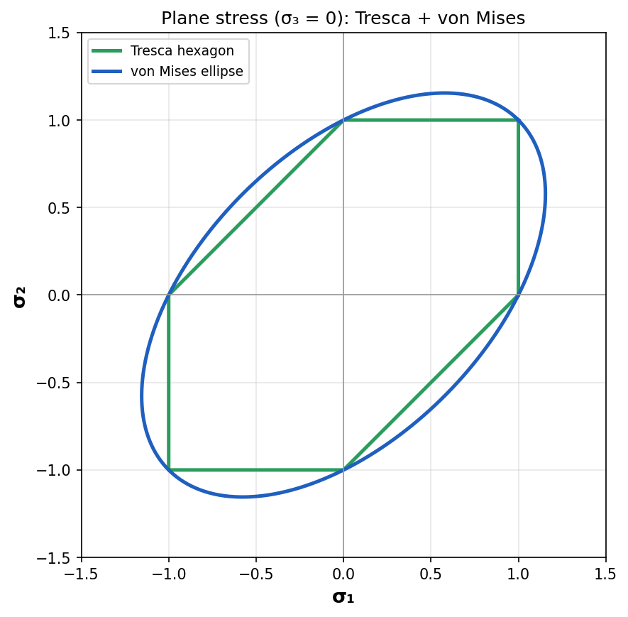 | 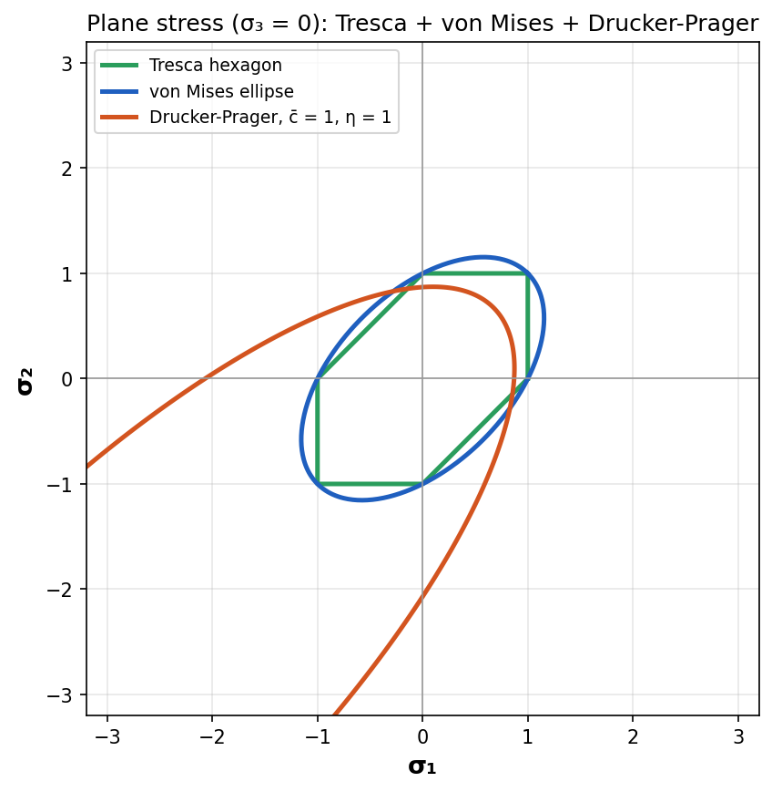 |

## The criteria

**Tresca** (maximum shear stress): yield when
$\tau_{max} = \tfrac{1}{2}\max|\sigma_i - \sigma_j| = \sigma_y / 2$.

**von Mises** (distortion energy):

```math
\sqrt{\tfrac{1}{2}\left[(\sigma_1-\sigma_2)^2 + (\sigma_2-\sigma_3)^2 + (\sigma_3-\sigma_1)^2\right]} = \sigma_y
\qquad\Longleftrightarrow\qquad \sqrt{3 J_2} = \sigma_y
```

**Drucker-Prager** (pressure-sensitive, for soils, rock, concrete,
granular media):

```math
\sqrt{J_2} = k - \alpha\, I_1
```

The tool parameterizes the cone by a cohesion-like constant $\bar c$ and a
friction parameter $\eta$: the deviatoric radius is $\bar c$ at $I_1 = 0$
and the apex sits on the hydrostatic axis at $\xi = \sqrt{3}\,\bar c/\eta$
(hydrostatic tension, tension-positive convention), which corresponds to
$k = \bar c/\sqrt{2}$ and $\alpha = \eta/(3\sqrt{2})$.

> [!TIP]
> Try Drucker-Prager with η = 0.5 and then η = 1 to watch the cone open and
> close; the apex moves from ξ = 3.46 c̄ to ξ = 1.73 c̄.

> [!CAUTION]
> Keep σ_y, c̄, and η positive. Negative or zero values have no physical
> meaning here and the surfaces will not be drawn correctly.

### Geometry used by the code

Points in principal stress space are written in cylindrical coordinates
about the hydrostatic axis $\mathbf n = (1,1,1)/\sqrt3$: a hydrostatic
coordinate $\xi = I_1/\sqrt3$ and a deviatoric radius $\rho = \sqrt{2J_2}$
with angle $\theta$ in the π-plane. Each criterion is just a rule
$\rho(\theta, \xi)$ — a constant for von Mises, a hexagon $\rho(\theta)$
for Tresca, a line $\rho(\xi)$ for Drucker-Prager. That is the whole file.

## Files

```
yield_criteria.py   the tool (GUI + CLI + flags) — no other code needed
figures/            the images above
```

> [!WARNING]
> The graphical interface uses `tkinter`, which ships with the standard
> Python installers on macOS and Windows. On some Linux distributions it is
> a separate package (`sudo apt install python3-tk`). If it is missing, the
> tool falls back to the question mode automatically.

## Author

**Aiden Azarnoush**

## License

MIT — see [LICENSE](LICENSE).

## References

- Hill, R. (1998). *The Mathematical Theory of Plasticity*
- Lubliner, J. (1990). *Plasticity Theory*
- Chen, W.F. & Han, D.J. (1988). *Plasticity for Structural Engineers*

---

## Dedication

*This work is dedicated to my beloved mother, **Simin Nematpour**, who
passed away. I love her and miss her deeply. Her memory continues to
inspire my academic pursuits and passion for engineering.*
