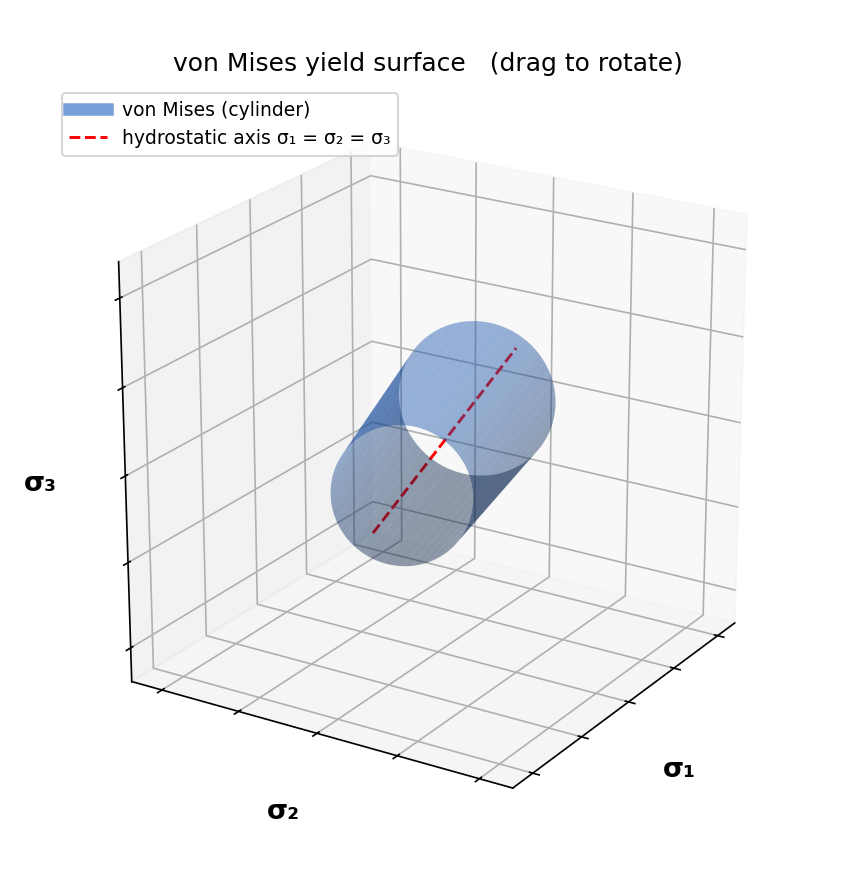
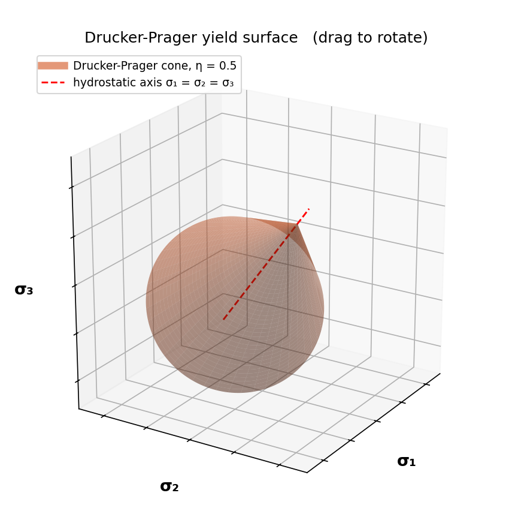
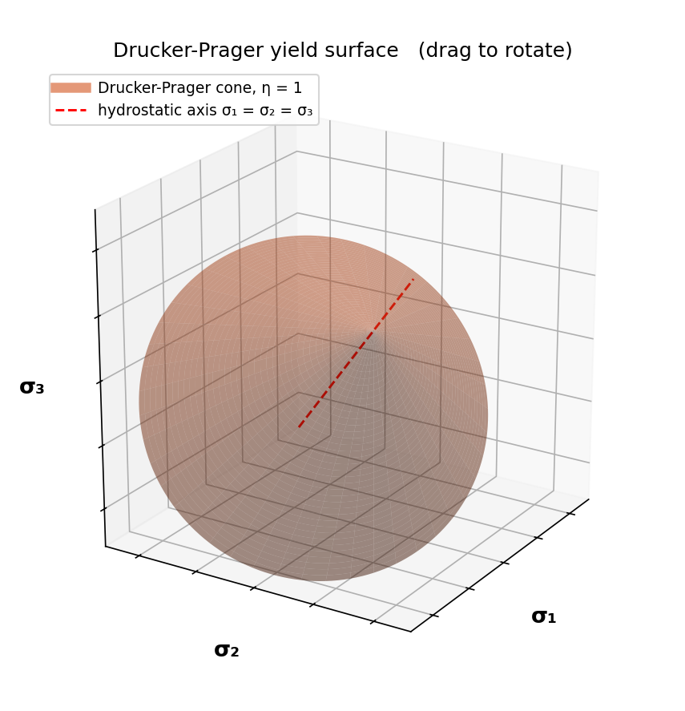
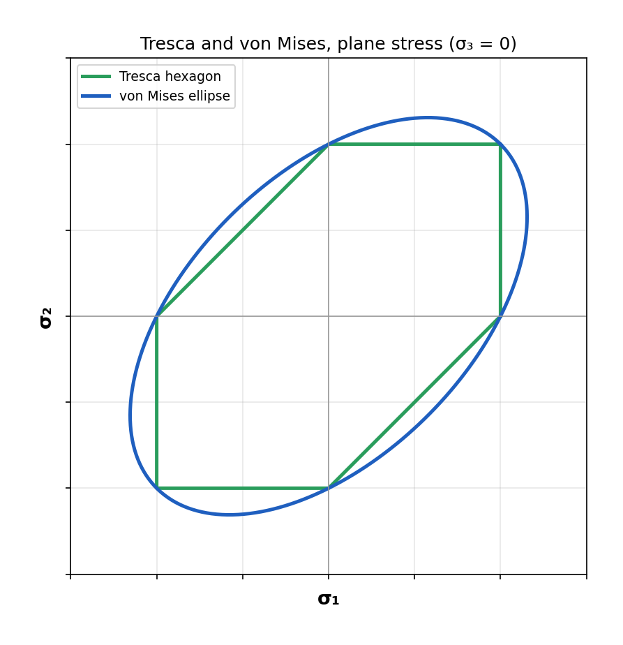
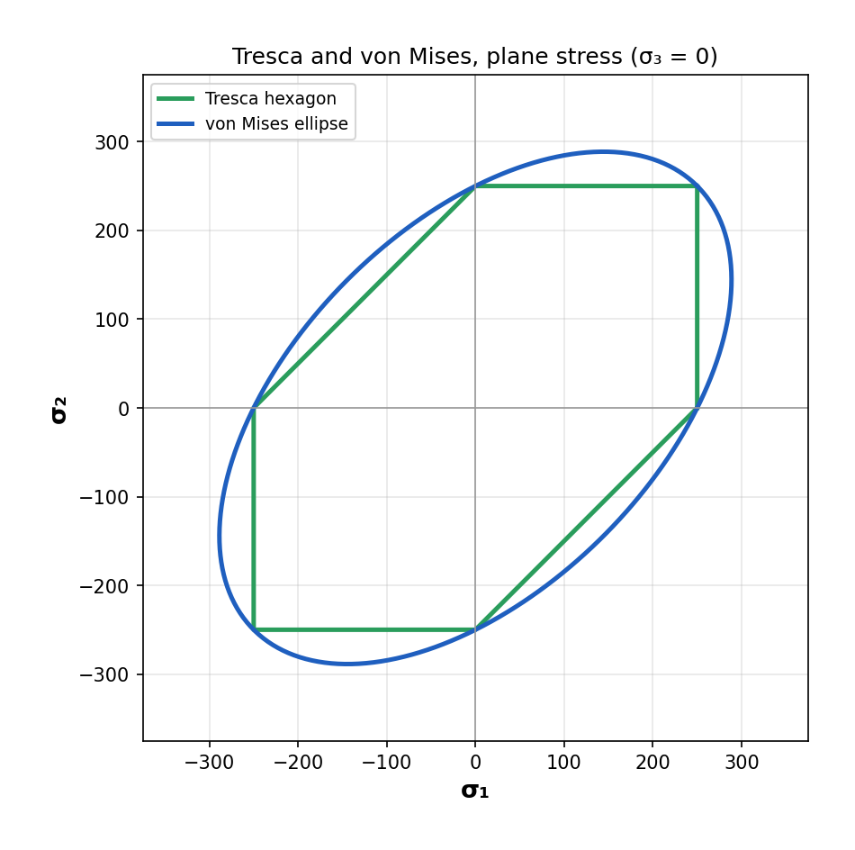
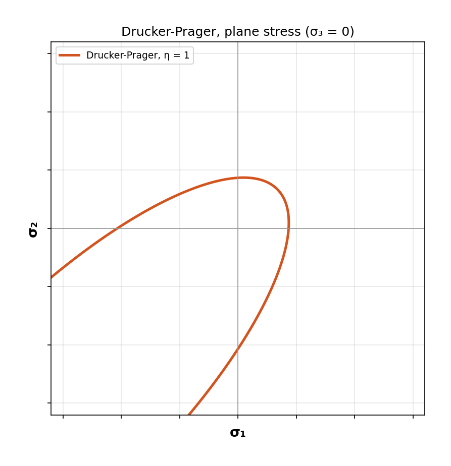
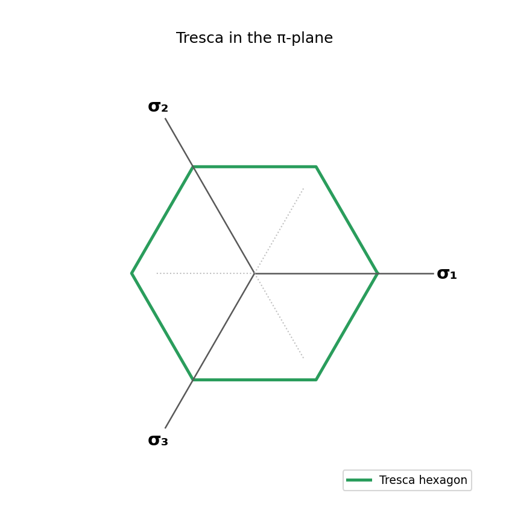
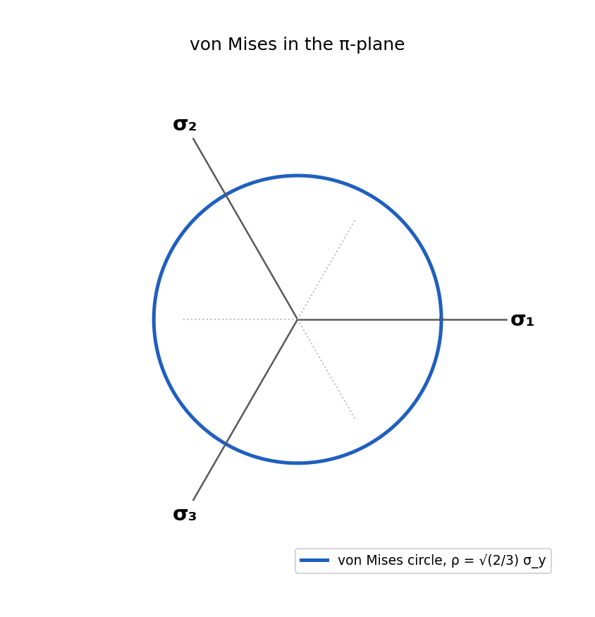
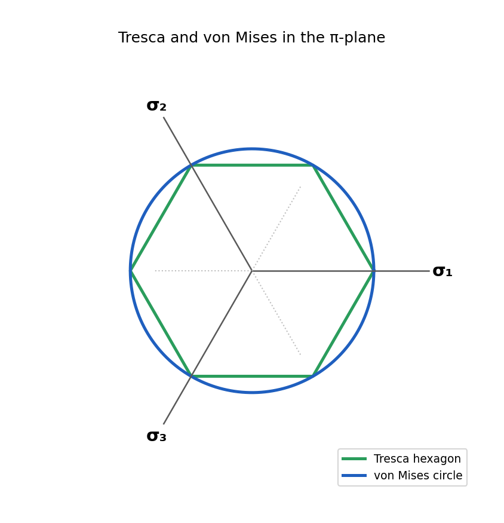
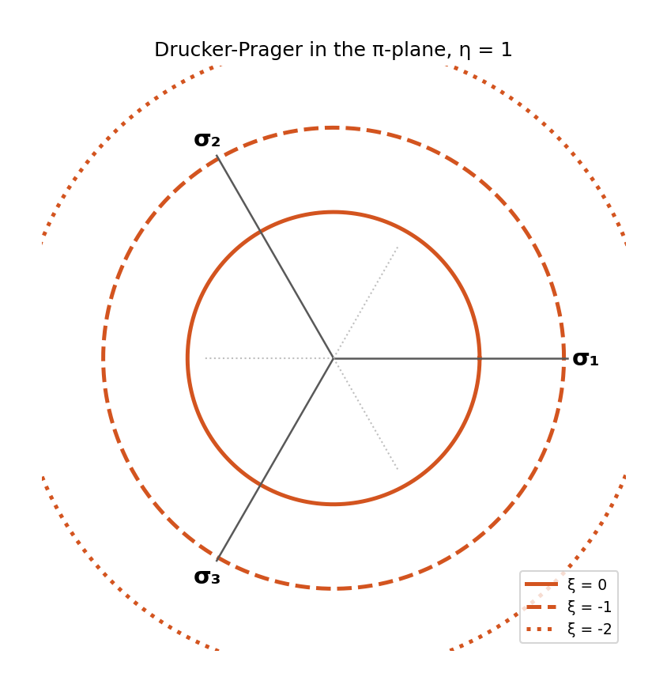

# Plasticity Yield Criteria Visualizer

Python visualizations of the classical yield criteria in plasticity —
**Tresca**, **von Mises**, and **Drucker-Prager** — in 3D principal stress
space, in 2D plane stress, and in the deviatoric π-plane. One file, a
small graphical interface, and a question-and-answer mode. Ask for a
picture with real numbers on the axes, or leave the constant empty and
get a clean schematic for a paper or a slide.

<p align="center">

</p>

## Run it

Download or clone the repository, install the two dependencies once, and
run the one file:

```bash
pip install numpy matplotlib
python yield_criteria.py          # graphical interface
python yield_criteria.py --cli    # question-and-answer mode
```

Both ask the same three questions:

```
Which criterion?
  1. Tresca
  2. von Mises
  3. Drucker-Prager
  4. Tresca + von Mises
Enter a number: 4

Which view?
  1. 3D principal stress space
  2. 2D plane stress (σ₃ = 0)
  3. π-plane (deviatoric stresses)
Enter a number: 1

Yield stress σ_y (any units, e.g. 250) (press Enter for a schematic plot):
```

> [!TIP]
> **Press Enter at the last question** and you get a *schematic* plot: the
> surface is normalized and the axes carry no tick numbers — the picture
> you want for a report, a slide, or a textbook figure. Type a number
> (say `250` for MPa) and the plot has real axes with real values.

> [!TIP]
> 3D plots open in a window you can **drag with the mouse to rotate** and
> scroll to zoom. Use the toolbar's save icon, or the GUI's *Save as
> image…* button, to export a PNG or PDF.

> [!NOTE]
> Drucker-Prager asks for its friction parameter **η** instead of σ_y
> (try 0.5 and 1). It is always drawn on its own: a pressure-sensitive
> cone next to the pressure-independent prisms just makes the picture
> messy, so the combination option is Tresca + von Mises.

The graphical interface has the same three choices as radio buttons, one
box for the constant, and two buttons:

```
 Criterion                     View
  ( ) Tresca                    (•) 3D principal stress space
  ( ) von Mises                 ( ) 2D plane stress (σ₃ = 0)
  ( ) Drucker-Prager            ( ) π-plane (deviatoric stresses)
  (•) Tresca + von Mises

 Constant  (σ_y, or η for Drucker-Prager)
  [        ]   leave empty for a schematic plot (no tick numbers)

  [   Plot   ]   [ Save as image… ]
```

> [!WARNING]
> The graphical interface uses `tkinter`, which ships with the standard
> Python installers on macOS and Windows. On some Linux distributions it is
> a separate package (`sudo apt install python3-tk`). If it is missing, the
> tool switches to the question mode automatically.

> [!CAUTION]
> The constant must be a **positive** number. The tool refuses negative
> values and zero and asks again — a yield stress of zero or less has no
> physical meaning, and the surfaces would collapse.

## What you get

### 3D principal stress space

Every surface is drawn around the hydrostatic axis σ₁ = σ₂ = σ₃ (dashed
red). Tresca is a hexagonal prism, von Mises the circular cylinder that
circumscribes it, Drucker-Prager a cone whose opening is set by η.

| Tresca | von Mises | Tresca + von Mises |
|---|---|---|
|  |  |  |

| Drucker-Prager, η = 0.5 | Drucker-Prager, η = 1 |
|---|---|
|  |  |

> [!IMPORTANT]
> The von Mises cylinder always **circumscribes** the Tresca prism; the two
> touch only along the six uniaxial-stress edges. That is why Tresca is the
> conservative criterion: it predicts yield at or before von Mises for
> every stress state.

### 2D plane stress (σ₃ = 0)

The classic textbook picture — the Tresca hexagon inside the von Mises
ellipse — and Drucker-Prager's pressure-sensitive loop, tight in tension and
open in compression.

| Tresca + von Mises (schematic) | Tresca + von Mises, σ_y = 250 | Drucker-Prager |
|---|---|---|
|  |  |  |

The middle picture is what you get by typing a number: the same shape, now
with real axis values.

### π-plane (deviatoric stresses)

The plane perpendicular to the hydrostatic axis. The projected σ₁, σ₂, σ₃
directions are 120° apart; Tresca is a regular hexagon inscribed in the
von Mises circle of radius ρ = √(2/3)·σ_y, touching it at the six uniaxial
directions.

| Tresca | von Mises | Tresca + von Mises | Drucker-Prager |
|---|---|---|---|
|  |  |  |  |

> [!NOTE]
> For Tresca and von Mises the π-plane section is the **same at every
> hydrostatic pressure** — that is the geometric meaning of "pressure
> independent". Drucker-Prager's section grows with compression, so the
> tool draws it at three hydrostatic levels ξ.

## The criteria

**Tresca** (maximum shear stress): yield when
$\tau_{max} = \tfrac{1}{2}\max|\sigma_i - \sigma_j| = \sigma_y/2$.

**von Mises** (distortion energy):

```math
\sqrt{\tfrac{1}{2}\left[(\sigma_1-\sigma_2)^2 + (\sigma_2-\sigma_3)^2 + (\sigma_3-\sigma_1)^2\right]} = \sigma_y
\qquad\Longleftrightarrow\qquad \sqrt{3J_2} = \sigma_y
```

**Drucker-Prager** (pressure-sensitive; soils, rock, concrete, granular
media):

```math
\sqrt{J_2} = k - \alpha\, I_1
```

drawn here as a cone with deviatoric radius $\bar c = 1$ at $I_1 = 0$ and
apex on the hydrostatic axis at $\xi = \sqrt{3}/\eta$ (hydrostatic
tension, tension-positive convention), i.e. $k = 1/\sqrt2$ and
$\alpha = \eta/(3\sqrt2)$.

## How the code is organized

One small function per criterion and view, named exactly what they draw:

```
tresca_3d    tresca_2d    tresca_pi
mises_3d     mises_2d     mises_pi
drucker_3d   drucker_2d   drucker_pi
both_3d      both_2d      both_pi        (Tresca + von Mises)
```

Each takes the constant and a `schematic` flag, builds the shape from a
handful of shared helpers (the hydrostatic-axis basis, a prism builder, a
hexagon, an ellipse, a circle), and hands the axes to a `finish_*`
routine for labels and limits. The menu and the GUI just pick a function
from a table. If you want to add a criterion, write one more function of
the same shape and add it to the table.

## Legacy MATLAB scripts

The original MATLAB versions live in [`matlab/`](matlab/) with their own
short README. They still run in base MATLAB and are kept for reference,
but the Python tool is the maintained version.

## Author

**Aiden Azarnoush**

## License

MIT — see [LICENSE](LICENSE).

## References

- Hill, R. (1998). *The Mathematical Theory of Plasticity*
- Lubliner, J. (1990). *Plasticity Theory*
- Chen, W.F. & Han, D.J. (1988). *Plasticity for Structural Engineers*

---

## Dedication

*This work is dedicated to my beloved mother, **Simin Nematpour**, who
passed away. I love her and miss her deeply. Her memory continues to
inspire my academic pursuits and passion for engineering.*
